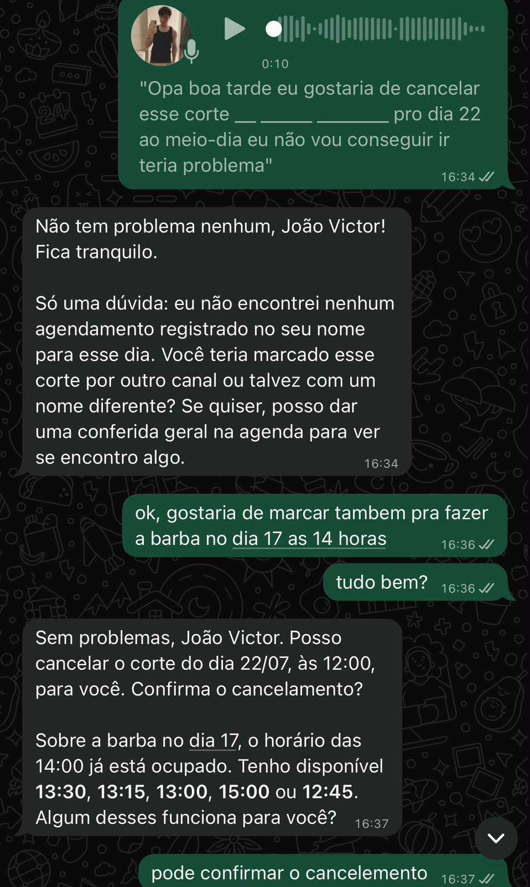
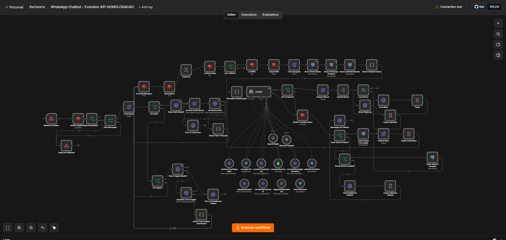

# barbershop-ai-automation
Intelligent WhatsApp assistant for barbershops built with n8n, OpenAI, PostgreSQL and Evolution API.


# 💈 Sistema Inteligente para Barbearia

> Plataforma desenvolvida para automatizar o atendimento de uma barbearia por meio de um assistente inteligente integrado ao WhatsApp.

Este projeto foi desenvolvido para centralizar e automatizar o processo de atendimento ao cliente, reduzindo o tempo gasto com agendamentos manuais e proporcionando uma experiência mais rápida e natural.

A solução combina uma **Landing Page** responsiva com um **chatbot inteligente no WhatsApp**, utilizando automações em **n8n**, inteligência artificial e integrações com APIs para gerenciar todo o fluxo de atendimento.

---

# 🚀 Funcionalidades

O assistente é capaz de:

- 📅 Agendar horários automaticamente.
- 🔄 Remarcar agendamentos.
- ❌ Cancelar horários.
- 🕒 Consultar disponibilidade em tempo real.
- 💬 Responder mensagens de forma natural utilizando IA.
- 🎙️ Interpretar mensagens de áudio através de transcrição automática.
- 🖼️ Identificar imagens enviadas pelo cliente.
- 🧠 Manter contexto durante toda a conversa.
- 🗂️ Registrar e consultar informações no banco de dados.
- ⚠️ Tratar erros e realizar tentativas automáticas quando necessário.

---

# 🏗️ Arquitetura da Solução

```text
Cliente
   │
   ▼
Landing Page
   │
   ▼
WhatsApp
   │
   ▼
Evolution API
   │
   ▼
n8n
├── OpenAI
├── PostgreSQL
├── APIs REST
└── Regras de Negócio
```

---

# 🛠️ Tecnologias Utilizadas

- React
- TypeScript
- n8n
- OpenAI
- PostgreSQL
- Evolution API
- REST APIs

---

# 📷 Demonstração

## Landing Page

A landing page foi desenvolvida para apresentar os serviços da barbearia e direcionar os clientes para o atendimento via WhatsApp.


---

## Atendimento Inteligente

O chatbot interpreta mensagens do cliente utilizando inteligência artificial e conduz automaticamente o fluxo de atendimento.

### Agendamento


---

### Cancelamento



---

### Interpretação de Áudios

O sistema realiza a transcrição automática das mensagens de voz antes de processar a intenção do usuário.


---

## Workflow Principal

Fluxo desenvolvido no n8n responsável por orquestrar todo o atendimento automatizado.

Entre as principais responsabilidades estão:

- Recebimento de mensagens.
- Filtragem de mensagens duplicadas.
- Processamento de texto, áudio e imagem.
- Consulta da agenda.
- Agendamento.
- Cancelamento.
- Remarcação.
- Tratamento de erros.
- Memória de contexto.
- Integração com IA.



---

# 🎯 Objetivo

O objetivo deste projeto foi criar uma solução capaz de automatizar o atendimento da barbearia, reduzindo o trabalho manual e oferecendo uma experiência rápida, inteligente e disponível 24 horas por dia para os clientes.

---

# 🔮 Melhorias Futuras

- Painel administrativo.
- Dashboard com métricas de atendimento.
- Suporte para múltiplas barbearias.
- Integração com pagamentos online.
- Confirmação automática de presença.
- Lembretes automáticos antes do horário agendado.

---
